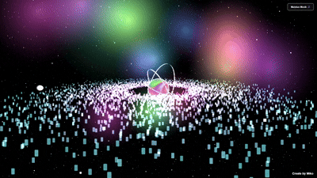

<!-- Banner -->
<p align="center">
  
</p>

<h1 align="center">🌌 Galaxy-Love 💫</h1>
<p align="center">
  <i>A cosmic journey that blends stardust & code — explore, interact, and fall in love with the galaxy.</i>
</p>

<p align="center">
 
</p>

---

## 🚀 Live Preview
<p align="center">
   
</p>

</p>

---

## ✨ Features
- 🌠 **Interactive Galactic Animation** — stars move & twinkle in real-time  
- 💖 **Romantic Space Vibes** — cosmic colors with a touch of love  
- 📱 **Responsive Design** — looks perfect on any device  
- ⚡ **Lightweight & Fast** — no heavy dependencies  

---

## 🛠️ Tech Stack
| Technology | Purpose |
|------------|---------|
| **HTML5**  | Structure |
| **CSS3**   | Styling & animations |
| **JavaScript** | Interactivity & effects |

---

## 📦 Installation
```bash
# Clone this repository
git clone https://github.com/Bleyker99/090525

# Navigate into the project
cd Galaxy-love

# Open in browser
start index.html   # Windows
open index.html    # Mac
